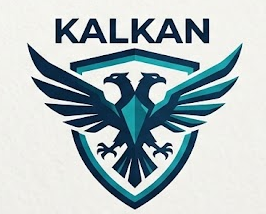

<div align="center">



### Advanced Windows Endpoint Security Audit & Hardening Platform
**Next-Generation CIS Benchmark Compliance, Vulnerability Intelligence & Automated Remediation**

[](https://python.org)
[](https://fastapi.tiangolo.com)
[](https://microsoft.com)
[](LICENSE)
[]()
[]()

[English](README.md) • [Türkçe Dokümantasyon](README.tr.md)

</div>

---

## 🛡️ Overview

**KALKAN** (*Turkish for "Shield"*) is an enterprise-grade, lightweight, and high-performance security auditing and system hardening platform built specifically for Windows workstations and servers. 

Operating under the **Zero-Truncation Principle**, KALKAN comprehensively assesses local security posture across **15 core audit modules** and **70+ granular security checks** without omitting or summarizing raw technical evidence. It bridges the gap between deep infrastructure visibility, vulnerability assessment, and one-click automated remediation.

---

## ✨ Key Capabilities

### 1. 🔍 Comprehensive 15-Module Security Engine
* **Antivirus & EDR Defense**: Evaluates Windows Defender engine status, Real-Time Protection, Cloud Protection, Tamper Protection, and signature freshness.
* **Application Whitelisting & Code Integrity**: Audits Windows Defender Application Control (WDAC), AppLocker policies, AMSI provider integrity, Developer Mode, and PowerShell Constrained Language Mode (CLM).
* **Attack Surface Reduction (ASR) & Risky Services**: Inspects Windows Script Host (WSH), legacy PowerShell v2, AutoRun/AutoPlay, Remote Registry, and Print Spooler exposures.
* **Credential Guard, LSA & LAPS Protection**: Verifies Windows Defender Credential Guard hardware isolation, WDigest plaintext credential caching, Windows LAPS status, and NTLMv1/LM mitigation.
* **Windows Firewall & Network Perimeter**: Evaluates Domain, Private, and Public profile active states, incoming traffic rules, and stealth mode.
* **Hardware, Boot & Kernel Integrity**: Deep audit of UEFI Secure Boot, TPM 2.0 cryptoprocessor, BitLocker volume encryption, LSA RunAsPPL, HVCI (Memory Integrity), and Virtualization-Based Security (VBS).
* **Identity, User Accounts & UAC**: Audits User Account Control (UAC) slider elevation levels, Guest account status, blank password policies, lockout thresholds, and local administrator sprawl.
* **Security Event Logging & Forensic Visibility**: Windows Security Event Log capacity, PowerShell Script Block Logging, Process Command Line Auditing, and Screen Lock policies.
* **Network Exposure, Open Ports & Protocols**: Maps all active listening ports, processes, SMBv1 protocol risk, LLMNR/NetBIOS broadcast leakage, RDP Network Level Authentication (NLA), and Wi-Fi security.
* **Persistence & Privilege Escalation**: Deep inspection of Unquoted Service Paths, Run / RunOnce registry autostarts, and Scheduled Tasks.
* **Credential & Secret Exposure (Secret Scan)**: Scans for unencrypted private SSH keys, cloud credentials (`.aws`, `.kube`), plaintext `.env` files, and terminal command history leaks.
* **Software Component Analysis (SCA) & SBOM**: Identifies installed third-party software, maps known CVEs and End-Of-Life (EOL) packages, and produces CycloneDX software inventory.
* **Storage & Removable Media Defense**: Audits USB storage access policies, BitLocker To Go mandatory encryption, and Kernel DMA protection against physical Thunderbolt attacks.
* **Web Browser & Client Hardening**: Audits Microsoft Edge, Google Chrome, and Opera version currency, DNS-over-HTTPS (DoH), SafeBrowsing policies, remote debugging ports, and extension trust.
* **Update & Patch Management Health**: Windows Update ring health, pending reboot states, Microsoft Defender signature update timestamps, and critical software patch lag.

---

### 2. 🎯 Vulnerability Intelligence & Standard Scoring
* **Universal Threat Scoring**: Every security check is enriched with standard CVSS v3.1 base metrics, Exploitability vectors, and Vulnerability Priority Rating (VPR).
* **Pre-configured Audit Templates**:
  1. *Host Discovery & Quick Audit* (Lightweight reconnaissance)
  2. *Basic Network & Port Exposure* (Network & listening services)
  3. *CIS Benchmark Compliance Audit* (Hardening standards)
  4. *Malware & Ransomware Exposure* (Ransomware attack surface evaluation)
  5. *Advanced Full Security Audit* (All 15 modules with deep SCA)
* **Executive Summary HTML Report**: Formatted executive reports displaying CVSS breakdown, risk distribution donuts, and high-priority vulnerability narratives.
* **Interoperable XML Export**: Standard format export for seamless ingestion into enterprise vulnerability management ecosystems.

---

### 3. ⚡ Automated Remediation & Instant Verification
* **Top Remediations Engine**: Automatically groups and ranks fixes based on risk score reduction potential.
* **One-Click PowerShell Fix Scripts**: Generates idempotent, production-tested PowerShell (`.ps1`) hardening scripts tailored specifically to the scan findings.
* **Instant Re-Verification**: Re-test individual findings in sub-second time without needing to run a full 15-module system scan.

---

### 4. 🌐 Enterprise Reporting & Integrations
* **OASIS SARIF v2.1.0**: Native export for GitHub Code Scanning, Azure DevOps, and OWASP DefectDojo.
* **CycloneDX v1.5 JSON SBOM**: Software Bill of Materials export for OWASP Dependency-Track and compliance registries.
* **Standalone Interactive HTML Report**: Dark/Light mode, searchable tables, printable styling, and Zero-Truncation findings view.
* **Raw JSON**: Clean, typed schema adhering to Pydantic models.

---

## 🚀 Quick Start

### Prerequisites
* Windows 10 / 11 / Server 2016+
* Python 3.10 or higher
* Recommended: PowerShell 5.1+ (Run terminal as Administrator for complete hardware & registry visibility)

### Installation
```powershell
# 1. Clone the repository
git clone https://github.com/your-username/kalkan.git
cd kalkan

# 2. (Optional) Create and activate virtual environment
python -m venv venv
.\venv\Scripts\Activate.ps1

# 3. Install dependencies
pip install -r requirements.txt
```

### Running Kalkan

#### Option A: Web Dashboard (GUI Mode)
```powershell
# Starts the local API server and automatically opens the browser at http://127.0.0.1:8765
python run.py
```
*Headless mode (no auto-open browser):*
```powershell
python run.py --no-browser --port 8765
```

#### Option B: Headless CLI (CI/CD Pipelines)
Run instantaneous audits in terminal with custom thresholds and output formats:
```powershell
# Run audit and output to terminal
python run.py --cli

# Export SARIF directly for CI/CD pipelines
python run.py --cli --format sarif --output kalkan-report.sarif

# Enforce security gates (fails with exit code 1 if critical issues exist)
python run.py --cli --fail-on-critical
```

---

## 🏗️ Architecture

```
KALKAN/
├── api/                   # FastAPI backend routes & WebSocket handlers
│   ├── routes.py          # REST endpoints, scan trigger, exports, plugin mappings
│   └── __init__.py
├── core/                  # Core audit engine & domain logic
│   ├── base.py            # Data models (ScanReport, CategoryResult, CheckResult)
│   ├── engine.py          # Concurrent & safe module execution engine
│   ├── registry.py        # Dynamic module registration & discovery
│   ├── templates.py       # Pre-configured security audit templates
│   ├── nessus_exporter.py # Standard XML & Executive HTML generators
│   ├── plugin_model.py    # Standard Plugin ID, CVSS v3.1 & VPR mapping
│   ├── remediation.py     # Priority remediation & PowerShell script builder
│   ├── exporter.py        # HTML, SARIF v2.1.0, CycloneDX v1.5 SBOM
│   ├── history.py         # Historical trend tracking & delta metrics
│   └── i18n.py            # Multilingual report translator
├── locales/               # Language catalogs (TR / EN)
├── docs/assets/           # Documentation visual assets & official logo
├── web/                   # Zero-dependency Vanilla Web UI
│   ├── index.html         # Single-page dashboard interface
│   ├── css/style.css      # Modern dark cybersecurity UI theme
│   ├── js/app.js          # Reactive controller, WebSocket client, dynamic renderers
│   └── js/i18n.js         # Client-side instantaneous language switcher (TR / EN)
├── run.py                 # Unified CLI & GUI entrypoint
└── requirements.txt       # Minimal, pinned dependencies
```

---

## 🌍 Multilingual Support (TR / EN)

KALKAN features native **Turkish and English** support across both its web dashboard and generated reports:
* Switch instantly between **TR** and **EN** from the top navigation bar without page reloads.
* All finding titles, explanations, remediation instructions, and severity ratings dynamically adapt to the active language.

---

## 🔒 Security & Privacy

* **100% Local Execution**: KALKAN performs all audits strictly on the local host. No telemetry, scan findings, or telemetry data are ever transmitted to external cloud servers.
* **Safe Read-Only Checks**: All scanner checks are non-destructive and query system state via Windows native APIs (`WMI`, `CIM`, `PowerShell`, `Registry`).
* **Zero Truncation**: No vulnerability details or outputs are clipped, guaranteeing full fidelity during forensic and compliance reviews.

---

## 📄 License

This project is licensed under the **MIT License** - see the [LICENSE](LICENSE) file for details.
