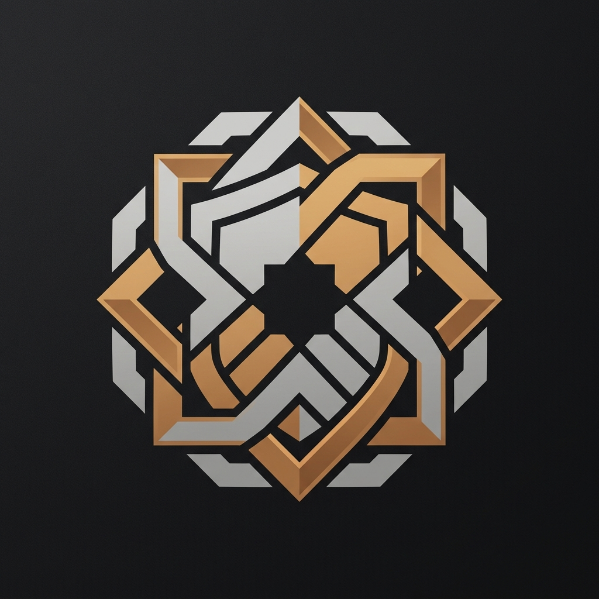

<div align="center">



# KALKAN

### Gelişmiş Windows Uç Nokta Güvenlik Denetim ve Sistem Sıkılaştırma Platformu
**Yeni Nesil CIS Benchmark Uyumluluğu, Tenable/Nessus Entegrasyonu ve Otomatik Sıkılaştırma**

[](https://python.org)
[](https://fastapi.tiangolo.com)
[](https://microsoft.com)
[](LICENSE)
[]()
[]()

[English Documentation](README.md) • [Türkçe Dokümantasyon](README.tr.md)

</div>

---

## 🛡️ Genel Bakış

**KALKAN**, Windows iş istasyonları ve sunucuları için özel olarak geliştirilmiş kurumsal düzeyde, hafif, hızlı ve yüksek hassasiyetli bir güvenlik denetimi ve sistem sıkılaştırma (hardening) platformudur.

**"Sıfır Kırpma" (Zero-Truncation) Prensibi** ile çalışan KALKAN, sistemin güvenlik duruşunu **15 temel denetim modülü** ve **70'in üzerinde ayrıntılı kontrol noktası** üzerinden hiçbir teknik kanıtı özetlemeden veya gizlemeden doğrudan analiz eder. Derin altyapı görünürlüğü, zafiyet tespiti ve tek tıkla otomatik düzeltme (PowerShell remediation) imkânı sunar.

---

## ✨ Temel Yetenekler

### 1. 🔍 Kapsamlı 15 Modüllü Güvenlik Motoru
* **Antivirüs & EDR Savunması**: Windows Defender durumu, Gerçek Zamanlı Koruma, Bulut Tabanlı Koruma, Kurcalama Koruması (Tamper Protection) ve imza güncelliği denetimi.
* **Uygulama İzin Verme & Kod Bütünlüğü**: WDAC (Windows Defender Application Control), AppLocker politikaları, AMSI sağlayıcı bütünlüğü, Geliştirici Modu ve PowerShell CLM (Constrained Language Mode).
* **Saldırı Yüzeyi Azaltma (ASR) & Zafiyetli Servisler**: Windows Script Host (WSH), eski PowerShell v2, AutoRun/AutoPlay, Remote Registry ve Print Spooler maruziyet analizi.
* **Kimlik Bilgisi, LSA & LAPS Koruması**: Windows Defender Credential Guard donanım izolasyonu, WDigest plaintext kimlik önbelleği, Windows LAPS durumu ve NTLMv1 engellemesi.
* **Güvenlik Duvarı & Ağ Çevre Güvenliği**: Domain, Private ve Public ağ profillerinin durumu, varsayılan gelen bağlantı filtreleme kuralları ve stealth mode.
* **Donanım, Önyükleme & Çekirdek Bütünlüğü**: UEFI Secure Boot, TPM 2.0 kripto işlemci, BitLocker sürücü şifrelemesi, LSA RunAsPPL, HVCI (Bellek Bütünlüğü) ve VBS (Sanallaştırma Tabanlı Güvenlik).
* **Kimlik, Hesaplar & UAC Politikaları**: Kullanıcı Hesap Denetimi (UAC) yetki seviyesi, Misafir (Guest) hesabı, boş parola kısıtlaması, hesap kilitlenme eşikleri ve yerel yönetici dağılımı.
* **Güvenlik Günlükleri & Adli Bilişim**: Windows Olay Günlüğü boyutu, PowerShell Script Block Logging, Süreç Komut Satırı Denetimi ve otomatik Ekran Kilitleme politikaları.
* **Ağ Maruziyeti, Açık Portlar & Protokoller**: Dinlenen tüm TCP/UDP portları ve bağlı süreçler, SMBv1 protokol riski, LLMNR/NetBIOS yayın sızıntıları, RDP NLA ve Wi-Fi güvenlik yapılandırmaları.
* **Kalıcılık & Yetki Yükseltme (Persistence)**: Tırnaksız Servis Yolları (Unquoted Service Paths), Run/RunOnce başlangıç kayıtları ve Zamanlanmış Görevler.
* **Kimlik Bilgisi ve Gizli Anahtar Taraması (Secret Scan)**: Açıkta kalan şifresiz SSH anahtarları, bulut kimlikleri (`.aws`, `.kube`), `.env` gizli anahtarları ve terminal geçmişi sızıntıları.
* **Yazılım Bileşen Analizi (SCA) & SBOM**: Yüklü 3. parti yazılımların envanteri, bilinen kritik CVE zafiyetleri ve EOL (Ömrünü Tamamlamış) yazılım tespiti.
* **Çevre Birimleri & Taşınabilir Medya Savunması**: USB depolama erişim ilkeleri, BitLocker To Go zorunlu şifreleme ve fiziksel Thunderbolt saldırılarına karşı Çekirdek DMA port koruması.
* **Web Tarayıcı ve İstemci Sıkılaştırma**: Edge, Chrome ve Opera sürüm güncelliği, DoH (DNS-over-HTTPS), SafeBrowsing politikaları, uzaktan hata ayıklama portları ve eklenti güvenliği.
* **Güncelleme, Yama Sağlığı & Yazılım Güncellemeleri**: Windows Update durumu, bekleyen yeniden başlatmalar, Defender imza güncellemeleri ve kritik yazılım yama durumu.

---

### 2. 🎯 Tenable / Nessus Ekosistem Uyumluluğu
* **Nessus Plugin Eşleştirmesi**: Her kontrol noktası Tenable Plugin ID, CVSS v3.1 temel skoru, sömürü vektörü ve VPR (Vulnerability Priority Rating) bilgisiyle zenginleştirilmiştir.
* **Önceden Tanımlı Tarama Şablonları**:
  1. *Host Keşfi ve Hızlı Denetim* (Temel sistem tanıma)
  2. *Temel Ağ ve Port Maruziyeti* (Dinlenen portlar ve ağ servisleri)
  3. *CIS Benchmark Uyumluluk Denetimi* (Sistem sıkılaştırma standartları)
  4. *Zararlı Yazılım & Fidye Yazılımı Açıklığı* (Ransomware saldırı yüzeyi)
  5. *İleri Düzey Tam Güvenlik Denetimi* (15 modülün tamamı ve SCA analizi)
* **Nessus v2 XML Dışa Aktarımı**: Tenable.sc, Tenable.io ve Nessus Professional sistemlerine doğrudan aktarılabilir `.nessus` formatında rapor üretimi.
* **Yönetici Özeti (Executive Summary) HTML**: CVSS puan dağılımı, risk çarkları ve yöneticiler için zafiyet özetlerini içeren şık raporlama.

---

### 3. ⚡ Otomatik Düzeltme (Remediation) & Anında Doğrulama
* **Öncelikli Düzeltmeler Sıralaması**: Güvenlik skorunu en hızlı artıran ve riski en çok düşüren adımları önceliklendirir.
* **Tek Tıkla PowerShell Düzeltme Betiği**: Tespit edilen bulgulara özel, hatasız çalışacak şekilde üretilmiş PowerShell (`.ps1`) sıkılaştırma betikleri oluşturur.
* **Tek Kontrolü Anında Doğrulama**: Tüm sistemi yeniden taramadan, uygulanan düzeltmenin başarılı olup olmadığını 1 saniyenin altında doğrular.

---

### 4. 🌐 Kurumsal Entegrasyon ve Raporlama
* **OASIS SARIF v2.1.0**: GitHub Code Scanning, Azure DevOps ve OWASP DefectDojo ile doğrudan uyumlu rapor çıktısı.
* **CycloneDX v1.5 JSON SBOM**: Yazılım Malzeme Listesi (SBOM) ile OWASP Dependency-Track entegrasyonu.
* **Tek Başına Çalışabilen HTML Raporu**: Sıfır dış bağımlılık, filtrelenebilir, yazdırılabilir ve koyu temalı web raporu.
* **Ham JSON Çıktısı**: Otomasyonlar ve SIEM/SOAR sistemleri için tip güvenli veri formatı.

---

## 🚀 Hızlı Başlangıç

### Gereksinimler
* Windows 10 / 11 / Server 2016+
* Python 3.10 veya üzeri
* Tavsiye: PowerShell 5.1+ (Tüm donanım ve kayıt defteri kontrolleri için terminali **Yönetici Olarak** çalıştırın)

### Kurulum
```powershell
# 1. Projeyi klonlayın
git clone https://github.com/kullanici-adiniz/kalkan.git
cd kalkan

# 2. (Opsiyonel) Sanal ortam oluşturup aktif edin
python -m venv venv
.\venv\Scripts\Activate.ps1

# 3. Bağımlılıkları yükleyin
pip install -r requirements.txt
```

### Kalkan'ı Çalıştırma

#### Seçenek A: Web Paneli (Arayüz Modu)
```powershell
# Yerel API sunucusunu başlatır ve tarayıcıda http://127.0.0.1:8765 adresini açar
python run.py
```
*Tarayıcının otomatik açılmasını istemiyorsanız:*
```powershell
python run.py --no-browser --port 8765
```

#### Seçenek B: Komut Satırı (CLI / CI-CD Modu)
Pipelines ve otomasyonlar için doğrudan konsolda tarama yapın:
```powershell
# Taramayı çalıştırır ve sonuçları terminale yazar
python run.py --cli

# Doğrudan SARIF formatında rapor oluşturur
python run.py --cli --format sarif --output kalkan-raporu.sarif

# Güvenlik eşiği (Kritik bulgu varsa çıkış kodu 1 döner, pipeline durdurulur)
python run.py --cli --fail-on-critical
```

---

## 🏗️ Proje Yapısı

```
KALKAN/
├── api/                   # FastAPI arka uç rotaları & WebSocket işleyicileri
│   ├── routes.py          # REST uç noktaları, tarama başlatma, dışa aktarmalar
│   └── __init__.py
├── core/                  # Çekirdek denetim motoru ve iş mantığı
│   ├── base.py            # Veri modelleri (ScanReport, CategoryResult, CheckResult)
│   ├── engine.py          # Eşzamanlı ve korumalı modül çalıştırma motoru
│   ├── registry.py        # Dinamik modül kayıt ve keşif mekanizması
│   ├── templates.py       # Nessus tarzı hazır denetim şablonları
│   ├── nessus_exporter.py # Nessus v2 XML ve Executive HTML oluşturucuları
│   ├── plugin_model.py    # Tenable Plugin ID, CVSS v3.1 ve VPR haritalama
│   ├── remediation.py     # Öncelikli düzeltme ve PowerShell betik üretici
│   ├── exporter.py        # HTML, SARIF v2.1.0, CycloneDX v1.5 SBOM
│   ├── history.py         # Geçmiş tarama trendleri ve metrik takibi
│   └── i18n.py            # Çok dilli rapor çevirici
├── locales/               # Dil katalogları (TR / EN)
├── docs/assets/           # Dokümantasyon görselleri ve resmi logo
├── web/                   # Sıfır bağımlı Vanilla Web arayüzü
│   ├── index.html         # Tek sayfa kontrol paneli
│   ├── css/style.css      # Siber güvenlik odaklı modern koyu tema
│   ├── js/app.js          # Reaktif denetleyici, WebSocket istemcisi, dinamik çizim
│   └── js/i18n.js         # İstemci tarafı anlık dil değiştirici (TR / EN)
├── run.py                 # Birleşik CLI & GUI başlatıcı
└── requirements.txt       # Minimal, sabitlenmiş bağımlılıklar
```

---

## 🌍 Çift Dil Desteği (TR / EN)

KALKAN, hem web panelinde hem de üretilen güvenlik raporlarında **Türkçe ve İngilizce** dillerini yerel olarak destekler:
* Sağ üst köşedeki dil seçiciden tek tıkla **TR** veya **EN** seçebilirsiniz.
* Tüm bulgu başlıkları, açıklamalar, düzeltme önerileri ve risk derecelendirmeleri anında seçilen dile çevrilir.

---

## 🔒 Güvenlik & Gizlilik

* **%100 Yerel Çalışma**: KALKAN tüm denetimleri sadece kendi makinenizde yürütür. Hiçbir tarama sonucu veya sistem bilgisi dış bulut sunucularına aktarılmaz.
* **Zararsız Salt-Okunur Kontroller**: Tüm tarayıcı kontrolleri güvenlidir ve sistem durumunu Windows yerel API'leri (`WMI`, `CIM`, `PowerShell`, `Kayıt Defteri`) üzerinden sorgular.
* **Sıfır Kırpma**: Adli bilişim ve uyumluluk denetimlerinde hiçbir zafiyet detayı veya hata çıktısı kırpılmaz.

---

## 📄 Lisans

Bu proje **MIT Lisansı** ile lisanslanmıştır - ayrıntılar için [LICENSE](LICENSE) dosyasına bakabilirsiniz.
